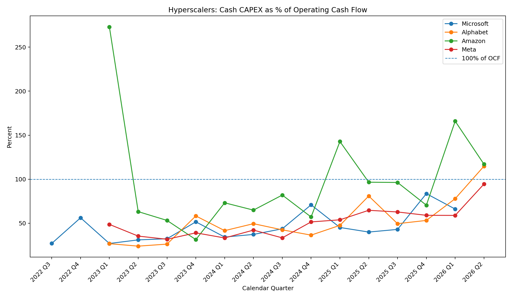
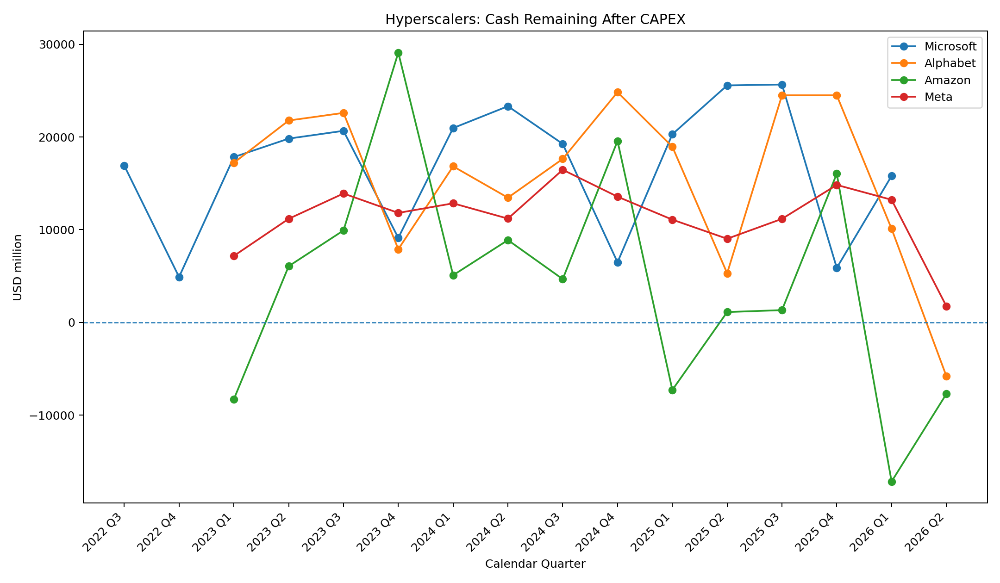
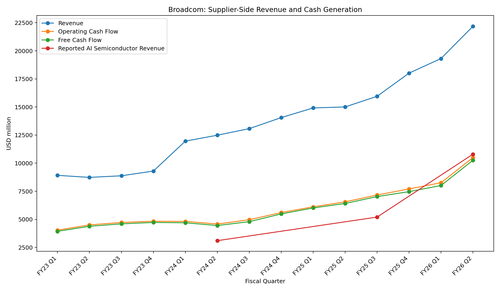

# AI Cash Flow Signals

Observing how cash flows through the AI economy.

This project tracks how cash moves across the AI infrastructure ecosystem — from hyperscaler operating cash flow and capital expenditure (CAPEX) to suppliers, funding markets, and liquidity conditions.

Unlike projects that try to predict an AI bubble or a market crash, this repository focuses on observing where cash comes from, where it goes, and where funding constraints begin to emerge.

## Project Purpose

The goal is not to predict prices.

The goal is to observe whether the AI economy can continue funding its current rate of expansion.

This repository treats cash flow as the primary signal behind AI infrastructure investment.

## Observation Framework

The project follows three layers of cash movement.

### Layer 1 — AI Cash Generation

Cash generated inside hyperscalers through operating activities.

Examples include:

- Operating Cash Flow
- CAPEX
- Free Cash Flow
- Cash Balance
- Debt Financing
- Interest Expense

### Layer 2 — AI Cash Distribution

Cash leaving hyperscalers and flowing into AI infrastructure suppliers.

Initial observation targets include:

- Broadcom
- NVIDIA (future)
- Other infrastructure suppliers (future)

### Layer 3 — Funding & Liquidity Signals

Financial markets that determine whether external funding remains available.

Examples include:
- Corporate Bond Issuance
- Treasury Yield
- SOFR
- Corporate Credit Spread

## Philosophy

This repository is an observation project.

It measures the circulation of cash rather than making predictions about whether AI succeeds or fails.

The question is simple:

> Can cash continue flowing through the AI economy?

---

## Current Signals / Initial Observation

The first observation cycle covers four major hyperscalers — Microsoft, Alphabet, Amazon, and Meta — together with Broadcom as a major supplier to the AI infrastructure ecosystem.

The purpose is not to determine whether AI investment is a bubble.

The purpose is to observe how cash is moving.

### 1. Hyperscalers: Cash Absorption

The first signal is the relationship between Operating Cash Flow and Cash CAPEX.

As AI infrastructure investment expands, a larger portion of internally generated cash is being absorbed by capital expenditure.

The key question is therefore not simply:

> How large is AI CAPEX?

but:

> How much of operating cash generation is being consumed by CAPEX?

This relationship is tracked through:

**Cash CAPEX / Operating Cash Flow**

A rising ratio does not by itself indicate financial stress.

However, it shows how rapidly investment requirements are approaching the cash-generating capacity of the underlying businesses.

---

### 2. Cash Remaining After CAPEX

The second signal looks at what remains after capital expenditure.

Conceptually:

**Operating Cash Flow  
→ CAPEX  
→ Cash Remaining**

This is important because large Operating Cash Flow alone does not tell us how much financial flexibility remains after infrastructure investment.

As CAPEX absorbs a larger share of operating cash generation, the next question becomes increasingly important:

> If internal cash becomes insufficient for the desired investment pace, where does the next dollar come from?

Possible sources include:

- Existing cash balances
- Debt issuance
- Equity financing
- Finance leases and other financing structures
- Slower investment growth

This is where a cash-flow observation can eventually connect to funding markets.

---

### 3. Broadcom: The Supplier Side of the Cash Flow

Cash spent by hyperscalers does not disappear.

It moves through the AI infrastructure supply chain.

Broadcom provides an initial view of the supplier side of this system.

The observation therefore moves from:

**Hyperscaler Cash Generation  
→ AI Infrastructure CAPEX  
→ Supplier Revenue  
→ Supplier Operating Cash Flow  
→ Supplier Free Cash Flow**

Broadcom is important here not simply because it is an AI-related company.

It represents the other side of the cash movement.

For hyperscalers, infrastructure investment absorbs cash.

For suppliers, that expenditure can become revenue and eventually operating cash flow.

This creates a measurable connection between the financing capacity of AI infrastructure buyers and the cash generation of the companies supplying that infrastructure.

---

## Initial Cash Flow Map

The project can therefore be viewed as a developing cash-flow map:

**Operating Cash Flow**

↓  

**AI CAPEX**

↓  

**Semiconductors / Networking / Data Centers / Power / Infrastructure**

↓  

**Supplier Revenue**

↓  

**Supplier Cash Flow**

At the same time, another path begins to matter when internal cash becomes more constrained:

**Operating Cash Flow**

↓  

**CAPEX**

↓  

**Free Cash Flow Pressure**

↓  

**Cash Balance / Debt / Equity / Other Financing**

↓  

**Interest Cost / Funding Capacity**

↓  

**Capital Market Conditions**

These two paths are connected.

The ability of suppliers to continue receiving AI infrastructure spending ultimately depends on the ability of customers to continue funding that spending.

---

## What This Project Is Watching

AI Cash Flow Signals is therefore not designed as a prediction of an AI bubble or an AI crash.

It is an observation system.

The central question is:

> Can cash continue to move through the AI economy at the pace required by current infrastructure investment?

The project will continue to observe:

- Operating Cash Flow
- Cash CAPEX
- CAPEX / Operating Cash Flow
- Cash remaining after CAPEX
- Cash and short-term liquidity
- Debt and other financing
- Interest and funding costs
- Supplier revenue
- Supplier Operating Cash Flow
- Supplier Free Cash Flow

The important signal may not be a single number.

It may be a change in where the constraint appears.

Today, the constraint may be CAPEX.

Later, it may move to Free Cash Flow, liquidity, debt markets, power infrastructure, supplier capacity, or another part of the system.

The objective is to observe that movement rather than predict it in advance.

---

## Current Coverage

### Hyperscalers

- Microsoft
- Alphabet
- Amazon
- Meta

### Supplier

- Broadcom

This is the initial observation set.

Additional companies and funding-market indicators will be added only when they help explain how cash is moving through the AI infrastructure system.
